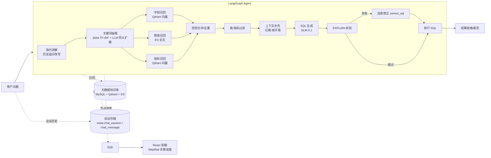

# shopagent-demo · 自然语言查询数据库Agent助手（Text-to-SQL）

一个面向电商数仓的**自然语言问数系统**：用户用中文提问（如"统计华北地区 2025 年第一季度的销售总额"），系统自动完成 指代消解 → 关键词抽取 → 元数据召回 → SQL 生成 → 校验自愈 → 执行 → 结果可视化的全流程，全程节点级进度流式推送。支持**多轮追问 + 指代消解**（如「那华东呢？」「换成按省份」）与**会话持久化**（刷新后自动恢复历史对话）。

## 架构



- **构建期**：从数仓（MySQL dw）抽取 表/字段/示例值/指标口径 → 结构化元数据入 MySQL（meta）、字段与指标向量化入 Qdrant、字段取值全文索引入 Elasticsearch。
- **查询期**：LangGraph 编排 13 个节点完成"指代消解 → 理解 → 召回 → 过滤 → 生成 → 校验 → 自愈 → 执行"。
- **会话期**：用户问题与助手结果持久化到 meta MySQL 的 `chat_session` / `chat_message` 表（按用户隔离），刷新后自动恢复历史，并为下一轮追问的指代消解提供上下文。

## 核心特性

- **13 节点 LangGraph 流水线**：状态与运行时上下文分离，节点独立、可观测、可插拔
- **多轮追问 + 指代消解**：入口节点结合会话历史把「那华东呢？」这类不完整追问改写成自包含问数需求
- **会话持久化**：会话与消息落 meta MySQL，刷新页面后自动恢复历史对话
- **用户认证与隔离**：注册/登录（JWT + PBKDF2-SHA256 密码哈希），会话按用户隔离，越权访问按不存在处理
- **三路混合检索**：jieba 关键词 + Qdrant 语义向量（bge-large-zh-v1.5）+ ES 全文取值检索，解决中文 Schema 语义歧义
- **SQL 自愈闭环**：基于真实数仓 `EXPLAIN` 校验，失败时携带完整上下文最小修正后重试
- **节点级 SSE 流式推送**：React 前端实时展示每一步骤状态与结果表格，支持中断取消
- **配置驱动元数据构建**：`meta_config.yaml` 定义表/字段/指标，一键重建知识库
- **端到端评测与可观测**：自建 255 条评测集（执行准确率 84.3%，easy 96.6%），Langfuse 轨迹追踪 + LLM-as-judge 语义评分
- **Docker Compose 一键部署**：MySQL8 / Elasticsearch8+Kibana / Qdrant / TEI

## 技术栈

| 模块 | 技术 |
|---|---|
| Agent 编排 | LangGraph |
| LLM 接入 | LangChain（SiliconFlow GLM-5.1，OpenAI 兼容，temperature=0） |
| 后端 | FastAPI（全异步，asyncmy / 异步 ES / 异步 Qdrant） |
| 向量检索 | Qdrant + TEI（BAAI/bge-large-zh-v1.5） |
| 全文检索 | Elasticsearch 8 |
| 数据存储 | MySQL 8（数仓 dw + 元数据 meta + 会话 chat_session/chat_message） |
| 认证 | PyJWT + PBKDF2-SHA256（注册/登录，JWT 用户级会话隔离） |
| 观测与评估 | Langfuse（轨迹追踪 + 评分 / LLM-as-judge）+ 自建评测集（见 `eval/`） |
| 前端 | React + Vite + TypeScript + Tailwind CSS |
| 工程化 | uv、Docker Compose、OmegaConf、loguru、python-dotenv |

## 快速开始

### 1. 启动基础服务（Docker Compose）

```bash
cd docker
docker compose up -d   # MySQL8 / ES8+Kibana / Qdrant / TEI embedding
```

首次启动会自动执行 `mysql/dw.sql`、`mysql/meta.sql` 初始化数仓与元数据库；会话表 `chat_session` / `chat_message` 除随 `meta.sql` 初始化外，也会在应用启动时通过 `CREATE TABLE IF NOT EXISTS` 幂等补齐，既有数据卷无需重建。

### 2. 配置环境

根目录没有现成的 `.env.example`，手动创建 `.env`：

```bash
# .env
LLM_API_KEY=sk-xxxxxxxx          # SiliconFlow 等 OpenAI 兼容服务的 API Key

# 可选：接入 Langfuse（轨迹追踪 + 评分），不配置则保持关闭
LANGFUSE_PUBLIC_KEY=pk-lf-xxxx   # Langfuse 项目公钥
LANGFUSE_SECRET_KEY=sk-lf-xxxx   # Langfuse 项目私钥
# LANGFUSE_HOST=https://cloud.langfuse.com   # 自建时改为自己的地址
```

`conf/app_config.yaml` 中可调整各服务地址、模型与索引名（LLM 的 api_key 已通过 `${oc.env:LLM_API_KEY}` 从环境变量读取）。Langfuse 默认关闭，开启需把 `langfuse.enabled` 设为 `true` 并配置上面的公钥/私钥。

### 3. 安装依赖并构建元数据知识库

```bash
uv sync
uv run python -m app.scripts.build_meta_knowledge -c conf/meta_config.yaml
# 从数仓抽取表/字段/示例值/指标 → 结构化入 MySQL、向量化入 Qdrant、全文入 ES
```

### 4. 启动后端与前端

```bash
uv run uvicorn main:app --host 0.0.0.0 --port 8000
cd frontend && pnpm install && pnpm dev   # 浏览器访问 Vite 地址
```

### 5. 体验

首次访问会进入登录页，需先注册或登录（`/api/auth/register`、`/api/auth/login`，返回 JWT）后才能发起问数；会话按用户隔离。

在对话框输入，例如：
- 统计 2025 年第一季度各大区的 GMV，并按 GMV 从高到低排序
- 查询华东地区 2025 年第一季度销售额最高的前 5 个商品
- 按会员等级统计 2025 年第一季度的订单数和销售额

支持在同一会话内多轮追问，指代会自动消解，例如：
1. 统计 2025 年第一季度各大区的 GMV，并按 GMV 从高到低排序
2. 那华东呢？（沿用上一轮的时间与指标口径）
3. 换成按省份统计（沿用 GMV 与时间，改为按省份分组）

刷新页面会自动恢复当前会话历史；点击「新会话」开启一段新的对话。

## 目录结构

```
app/
├── agent/            # LangGraph 图编排与 13 个节点（指代消解/召回/过滤/生成/校验/修正/执行）
├── api/              # FastAPI 路由、依赖注入、lifespan
├── clients/          # MySQL / ES / Qdrant / Embedding 客户端管理
├── conf/             # OmegaConf 配置加载
├── core/             # 日志、请求上下文（ContextVar 追踪）、认证安全（JWT/密码哈希）
├── entities/         # 业务实体（表/字段/指标/取值）
├── models/           # ORM 模型（元数据 + 会话 + 用户）
├── prompt/           # Prompt 模板加载器
├── repositories/     # 数据访问层（MySQL 元数据/会话 / Qdrant / ES）
├── scripts/          # 元数据知识库构建脚本
└── services/         # 元数据构建 / 问数查询 / 会话读取服务
conf/                 # app_config.yaml / meta_config.yaml
docker/               # docker-compose + MySQL 初始化 SQL + ES 镜像
frontend/             # React + Vite 前端（SSE 消费、步骤进度、结果表格）
prompts/              # 9 个独立 Prompt 模板
eval/                 # 端到端评测：评测集 / 评测 harness / 指标归一化 / LLM-judge / 报告
docs/                 # 架构图与演示截图
```

## Prompt 设计

`prompts/` 下 9 个独立模板：`rewrite_query`、`generate_sql`、`correct_sql`、`extend_keywords_for_column/metric/value_recall`、`filter_metric_info`、`filter_table_info`、`sql_judge`。生成 SQL 时通过硬约束降低幻觉：禁止编造表和字段、严格遵循指标口径、方言/版本合规、仅单条 SQL、聚合列必须 AS 别名、纯文本输出（禁 Markdown 代码块）。`rewrite_query` 负责结合历史对话消除指代与省略，把追问改写成自包含的完整问数需求；`sql_judge` 用于 LLM-as-judge 语义评分。

## 评测与可观测

- **评测集**：`eval/dataset.yaml` 约 255 条真实问数需求，覆盖地区/时间/商品/客户四维、GMV·销售额·销量·订单数·客单价等指标、排序 TOP N、过滤、HAVING、多表 JOIN、交叉维度与边界场景，分 easy/medium/hard 三档；`run_eval.py` 启动前会全量校验金标准 SQL。
- **执行准确率（EA）**：生成 SQL 与金标准 SQL 的结果集归一化后一致才判对。当前整体 EA **84.3%**（easy 96.6% / medium 84.4% / hard 72.6%），失败模式自动分类为 wrong_result / wrong_empty / validation_failed / execution_error / graph_error。
- **Langfuse 轨迹**：开启后每条查询/评测产出一条 trace（节点=span、LLM 调用=generation），并把 EA / 失败类别 / 延迟 / LLM-judge 作为 score 写回，便于线上聚合分析。
- **LLM-as-judge**：`--judge` 时额外用大模型对「生成 SQL 是否语义等价金标准」打分（0~1 + 理由），作为 EA 的定性补充。

运行方式与指标定义详见 [eval/README.md](eval/README.md)。

## 说明

- 演示环境的数据库账号密码见 `docker/docker-compose.yaml` 与 `conf/app_config.yaml`（仅限本地开发）。
- LLM API Key 通过 `.env` 注入，请勿提交到仓库。
- 会话数据落在 meta MySQL 的 `chat_session` / `chat_message` 表，与元数据知识库分表隔离；元数据重建脚本 `build_meta_knowledge` 只清空 4 张元数据表，不影响会话历史。
