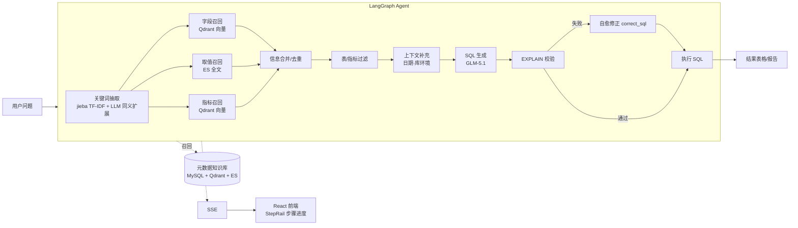

# shopagent-demo · 自然语言查询数据库Agent助手（Text-to-SQL）

一个面向电商数仓的**自然语言问数系统**：用户用中文提问（如"统计华北地区 2025 年第一季度的销售总额"），系统自动完成 关键词抽取 → 元数据召回 → SQL 生成 → 校验自愈 → 执行 → 结果可视化的全流程，全程节点级进度流式推送。

## 架构



- **构建期**：从数仓（MySQL dw）抽取 表/字段/示例值/指标口径 → 结构化元数据入 MySQL（meta）、字段与指标向量化入 Qdrant、字段取值全文索引入 Elasticsearch。
- **查询期**：LangGraph 编排 12 个节点完成"理解 → 召回 → 过滤 → 生成 → 校验 → 自愈 → 执行"。

## 核心特性

- **12 节点 LangGraph 流水线**：状态与运行时上下文分离，节点独立、可观测、可插拔
- **三路混合检索**：jieba 关键词 + Qdrant 语义向量（bge-large-zh-v1.5）+ ES 全文取值检索，解决中文 Schema 语义歧义
- **SQL 自愈闭环**：基于真实数仓 `EXPLAIN` 校验，失败时携带完整上下文最小修正后重试
- **节点级 SSE 流式推送**：React 前端实时展示每一步骤状态与结果表格，支持中断取消
- **配置驱动元数据构建**：`meta_config.yaml` 定义表/字段/指标，一键重建知识库
- **Docker Compose 一键部署**：MySQL8 / Elasticsearch8+Kibana / Qdrant / TEI

## 技术栈

| 模块 | 技术 |
|---|---|
| Agent 编排 | LangGraph |
| LLM 接入 | LangChain（SiliconFlow GLM-5.1，OpenAI 兼容，temperature=0） |
| 后端 | FastAPI（全异步，asyncmy / 异步 ES / 异步 Qdrant） |
| 向量检索 | Qdrant + TEI（BAAI/bge-large-zh-v1.5） |
| 全文检索 | Elasticsearch 8 |
| 数据存储 | MySQL 8（数仓 dw + 元数据 meta） |
| 前端 | React + Vite + TypeScript + Tailwind CSS |
| 工程化 | uv、Docker Compose、OmegaConf、loguru、python-dotenv |

## 快速开始

### 1. 启动基础服务（Docker Compose）

```bash
cd docker
docker compose up -d   # MySQL8 / ES8+Kibana / Qdrant / TEI embedding
```

首次启动会自动执行 `mysql/dw.sql`、`mysql/meta.sql` 初始化数仓与元数据库。

### 2. 配置环境

根目录没有现成的 `.env.example`，手动创建 `.env`：

```bash
# .env
LLM_API_KEY=sk-xxxxxxxx          # SiliconFlow 等 OpenAI 兼容服务的 API Key
```

`conf/app_config.yaml` 中可调整各服务地址、模型与索引名（LLM 的 api_key 已通过 `${oc.env:LLM_API_KEY}` 从环境变量读取）。

### 3. 安装依赖并构建元数据知识库

```bash
uv sync
uv run python -m app.scripts.build_meta_knowledge -c conf/meta_config.yaml
# 从数仓抽取表/字段/示例值/指标 → 结构化入 MySQL、向量化入 Qdrant、全文入 ES
```

### 4. 启动后端与前端

```bash
uv run uvicorn main:app --host 0.0.0.0 --port 8000
cd frontend && pnpm install && pnpm dev   # 浏览器访问 Vite 地址
```

### 5. 体验

在对话框输入，例如：
- 统计 2025 年第一季度各大区的 GMV，并按 GMV 从高到低排序
- 查询华东地区 2025 年第一季度销售额最高的前 5 个商品
- 按会员等级统计 2025 年第一季度的订单数和销售额

## 目录结构

```
app/
├── agent/            # LangGraph 图编排与 12 个节点（召回/过滤/生成/校验/修正/执行）
├── api/              # FastAPI 路由、依赖注入、lifespan
├── clients/          # MySQL / ES / Qdrant / Embedding 客户端管理
├── conf/             # OmegaConf 配置加载
├── core/             # 日志、请求上下文（ContextVar 追踪）
├── entities/         # 业务实体（表/字段/指标/取值）
├── models/           # ORM 模型
├── prompt/           # Prompt 模板加载器
├── repositories/     # 数据访问层（MySQL / Qdrant / ES）
├── scripts/          # 元数据知识库构建脚本
└── services/         # 元数据构建 / 问数查询服务
conf/                 # app_config.yaml / meta_config.yaml
docker/               # docker-compose + MySQL 初始化 SQL + ES 镜像
frontend/             # React + Vite 前端（SSE 消费、步骤进度、结果表格）
prompts/              # 8 个独立 Prompt 模板
```

## Prompt 设计

`prompts/` 下 8 个独立模板：`generate_sql`、`correct_sql`、`extend_keywords_for_column/metric/value_recall`、`filter_metric_info`、`filter_table_info`。生成 SQL 时通过硬约束降低幻觉：禁止编造表和字段、严格遵循指标口径、方言/版本合规、仅单条 SQL、聚合列必须 AS 别名、纯文本输出（禁 Markdown 代码块）。

## 说明

- 演示环境的数据库账号密码见 `docker/docker-compose.yaml` 与 `conf/app_config.yaml`（仅限本地开发）。
- LLM API Key 通过 `.env` 注入，请勿提交到仓库。
